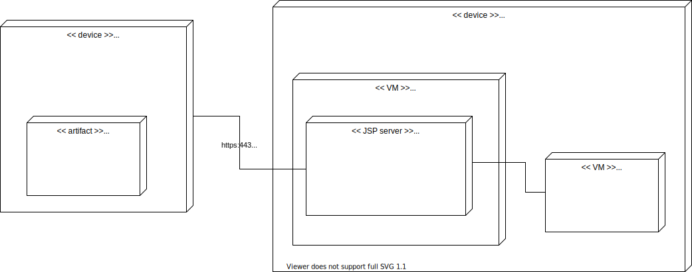

# Software Architecture Document 
{: .no_toc }

## Table of contents
{: .no_toc .text-delta }

1. TOC
{:toc}

# Revision History

|--------------------|--------------------|--------------------|--------------------|
| **Date**           | **Version**        | **Description**    | **Author**         |
|--------------------|--------------------|--------------------|--------------------|
| 22.11.2020         | 1.0                | Initial            | jatsqi             |
|--------------------|--------------------|--------------------|--------------------|

## 1. Introduction

### 1.1 Purpose

This document provides a comprehensive architectural overview of the
system, using a number of different architectural views to depict
different aspects of the system.  It is intended to capture and convey
the significant architectural decisions which have been made on the
system.

### 1.2 Scope

This document tries to accurately describe the architecture of the Vaultionizer project with its two main components:
* The frontend (Android App)
* The backend (Spring Boot REST-API)

### 1.3 Definitions, Acronyms and Abbreviations

| Abbrevation | Explanation                            |
|:-----------:|:--------------------------------------:|
| SAD         | Software Architecture Document         |
| UC          | Use Case                               |
| n/a         | not applicable                         |
| tbd         | to be determined                       |
| REST        | Representational State Transfer        |
| API         | Application Programming Interface      |
| MVC         | Model View Controller                  |
| MVVM        | Model View View-Model                  |
| SSOT        | Single Source of Truth                 |

### 1.4 References

[This subsection should provide a complete list of all documents
referenced elsewhere in the **Software Architecture Document**.  Each
document should be identified by title, report number (if applicable),
date, and publishing organization.  Specify the sources from which the
references can be obtained. This information may be provided by
reference to an appendix or to another document.]

### 1.5 Overview

The following sections provide an overview about the architecture with its layers, how we organize the flow of data, implementation details and how the deployment process works.

## 2. Architectural Representation

For the backend and the whole architecture we are using the MCV design pattern. This pattern allows us to clearly separate the business logic from the data itself which leads to a very clean and maintainable code basis.

## 3. Architectural Goals and Constraints

### 3.1 Security

#### 3.1.1 Connection
All of our software components require an encrypted connection in order to exchange data with each other, otherwise we would risc the leakage of user data to the public internet.
The Spring Boot Backend will block all incoming requests that were not received encrypted by the host system. Because of this, a reverse proxy is still possible and we can still remain a lot of flexibility. 
Similar to the backend, the frontend will only allow connections to hosts with a valid SSL certificate.

#### 3.1.2 Authentication
The backend will receive the userID and the hashed password.
If these credentials are valid, the backend will response with a short lived session token which will be used for all further requests. 

#### 3.1.2 Data
The backend will follow one very important philosophy, which is the very core of our project: The single purpose of the backend is to keep track of users, files, spaces and of course user authentication. Nothing more.
This implies that the backend has nothing to do with file encryption at all: It just receives the encrypted data and stores it on the host file system.
All encryption and decryption of the user data is done in the frontend, which receives the data and decrypts it with the keys from the native key store.

### 3.2 Privacy
The frontend will not collect any personal information at all. The only information necessary in order to use all app features are a valid username and password.
All analytical data is anonymized.

### 3.3 Distribution
Both components will be distributed on multiple ways. For the backend a Docker image will be available via the GHCR and Docker Hub.
The Android App will be downloadable via
* the Android Play Store
* a downloadable APK from our website

## 4. Use-Case View

- Green: Planned until end of December
- White: Planned until end of June (second semester)

### 4.1 Use-Case Realizations
tbd

## 5. Logical View

[This section describes the architecturally significant parts of the
design model, such as its decomposition into subsystems and packages.
And for each significant package, its decomposition into classes and
class utilities. You should introduce architecturally significant
classes and describe their responsibilities, as well as a few very
important relationships, operations, and attributes.]

### 5.1 Overview

For the backend our "high level" architecture looks like this:

#### 5.1.1 Repository Layer
We use repositories as a typical SSOT for all data requests from the service layer.
They provide all methods in order to access different kinds of data.
The repository layer also connects the database with the other layers.

#### 5.1.2 Service Layer
This layer contains additional business logic to handle requests. Operations like saving/reading files from the filesystem and additional checks are also done here.
It is also pretty important to note here, that data from database (repository layer) is not exposed directly to the web layer. Instead the data from the domain model (entities which represent the database) is converted into DTOs, which provide all the data necessary to fullfil a request, nothing more.

#### 5.1.3 Web Layer
The Web-Layer consists of controller which accepts different kinds of requests from a client.
This layer also does things like authentication and a first request validation.

### 5.2 Architecturally Significant Design Packages

#### 5.2.1 Repositories

On this diagram you can see a detailed overview about all the repositories, their corresponding service and the dependencies between them.

## 6. Process View

n/a

## 7. Deployment View

## 8. Implementation View

### 8.1 Overview

You can have a look at the class diagram of the backend - for a more detailed overview:

The class diagram for the frontend is not finished yet because it includes auto-generated classes which are not that important in order to understand the overall architecture.

### 8.2 Layers

n/a

## 9. Data View

In order to store data persistent we use a PostgreSQL database.
Our data model looks like this:

## 10. Size and Performance

n/a

## 11. Quality

Our goal is to make the backend with all its components as maintainable as possible.
Because the backend consists of many separated and easily exchangeable layers it is very easy to switch e.g. between databases.
