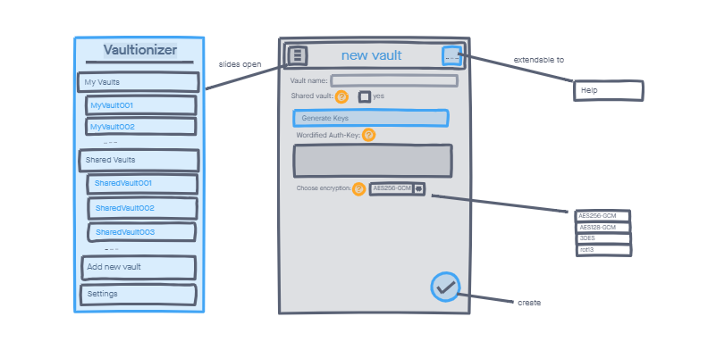
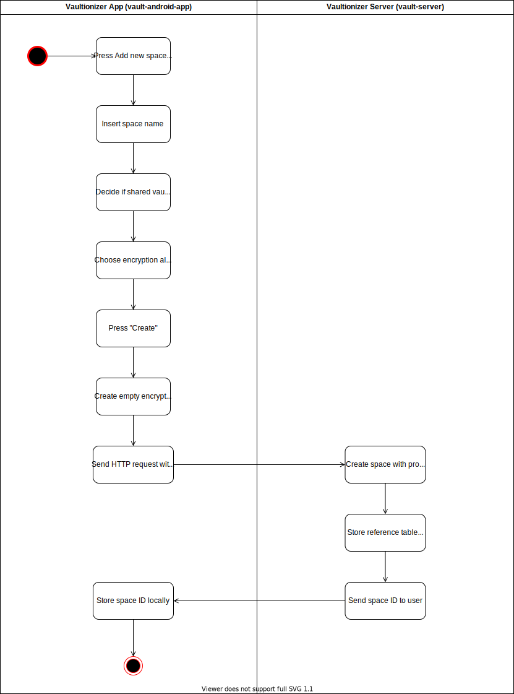

# Use Case Specification: Create Space
{: .no_toc }

## Table of contents
{: .no_toc .text-delta }

1. TOC
{:toc}

## Create Space
### Brief Description
In order to create a space the user has to specify certain properties (e.g. local space name and encryption algorithm for the keys).
The properties are then tranfered to the server via a HTTP Rest-call. 

### Mockup

## Flow of Evenets
### Basic Flow

## Gherkin file
You can find the feature file for this use case [here](https://github.com/Vaultionizer/vault-android-app/blob/master/app/src/test/java/com/vaultionizer/vaultapp/features/Add-new-vault.feature).

### Alternative Flow
n/a

## Special Requirements
n/a

## Preconditions
* User is logged in

## Postconditions
* The space was created with given parameters
* The user has access to the space

## Extension Points
n/a

## Function Points

Function points: **28.89**