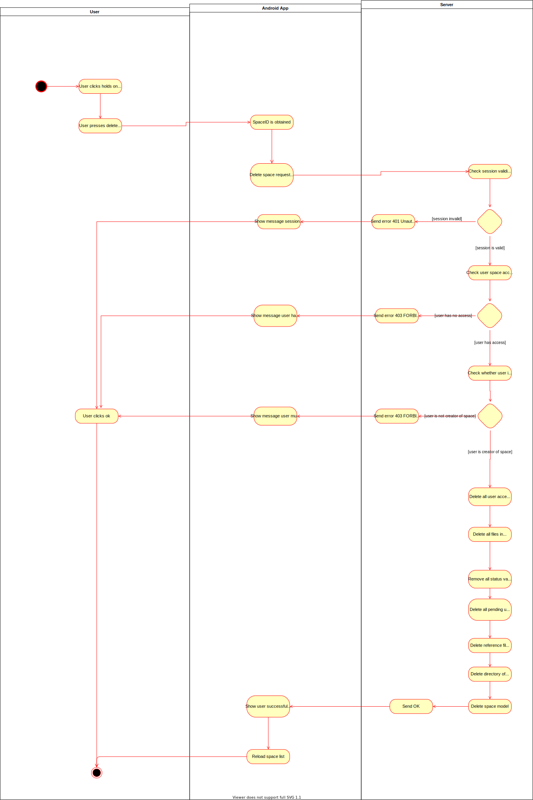

# Use Case Specification: Delete space
{: .no_toc }

## Table of contents
{: .no_toc .text-delta }

1. TOC
{:toc}

## Show file structure
### Brief Description
The user requests to delete a specific space (given a unique spaceID). The server checks whether the session is valid, the user has access to a space (implicitly checks whether space exists) and the user is the creator of the space. If all apply, the server deletes all contents that are linked to the space.

### Mockup
tbd

## Flow of Evenets
### Basic Flow

## Gherkin file
tbd

### Alternative Flow
n/a

## Special Requirements
n/a

## Preconditions
* User is logged in
* User has valid session key
* User has the spaceID (indirectly through the Application)

## Postconditions
* User cannot see the space anymore (other users cannot either)
* User all files in space are deleted (both in database and in filesystem)
* Reference file has been deleted
* Individual user accesses are deleted
* No more files are set to READ_FROM (all deleted from hashmap)
* SpaceModel for space is deleted

## Extension Points
n/a
