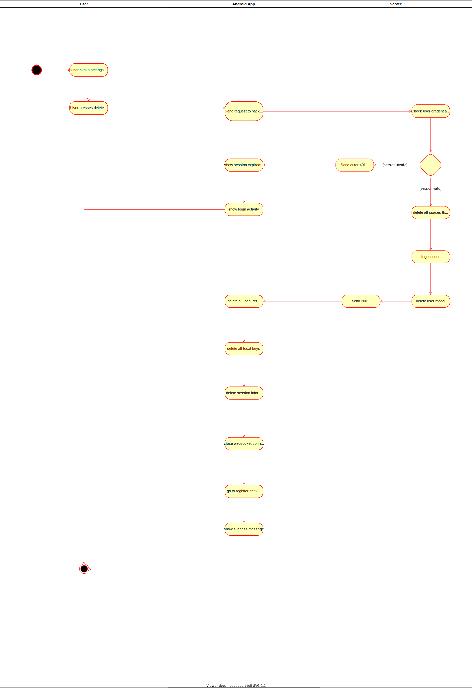
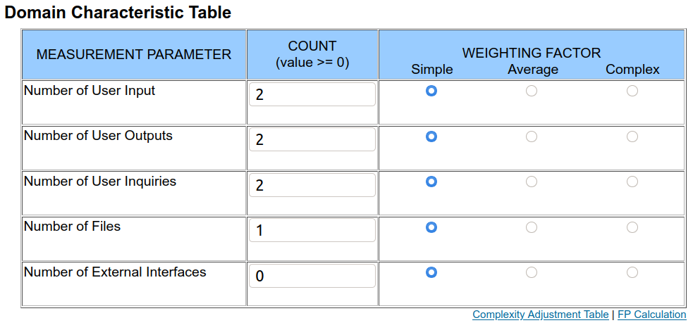

# Use Case Specification: Delete user
{: .no_toc }

## Table of contents
{: .no_toc .text-delta }

1. TOC
{:toc}

## Show file structure
### Brief Description
The user wants to delete his own account. The application requests the server to delete the user including all spaces the user has created, all references to the user and the user model itself. Apart from that, the session is deleted, thus the user is logged out. 
On the application's side, all local reference files (the local copies of spaces' reference files) are deleted, all local keys are deleted. Apart from that, the session information is deleted and a potentially open websocket connection is closed. The register activity is started and a success message is shown.

### Mockup
tbd

## Flow of Evenets
### Basic Flow

## Gherkin file
[The feature file](https://github.com/Vaultionizer/vault-server/blob/develop/src/test/resources/features/deleteUser.feature)

### Alternative Flow
n/a

## Special Requirements
n/a

## Preconditions
* User is logged in
* User has valid session key

## Postconditions
* All user information is deleted
* All spaces the user is creator of are deleted
* The user is removed from all spaces the user joined in the past
* All local assets are deleted
* User is brought to the register activity

## Extension Points
n/a

## Function Points

Function points: **36.38**