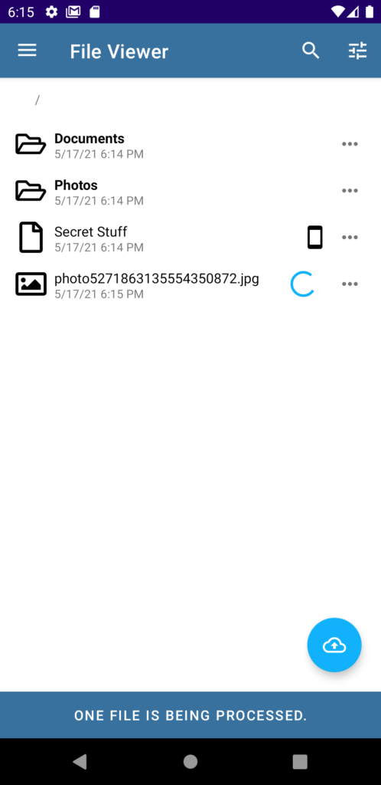
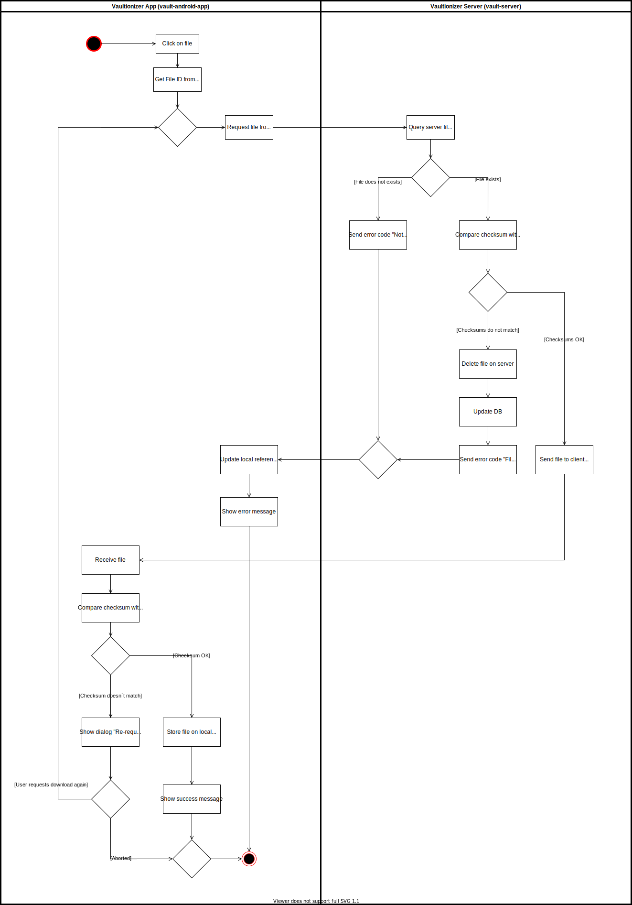
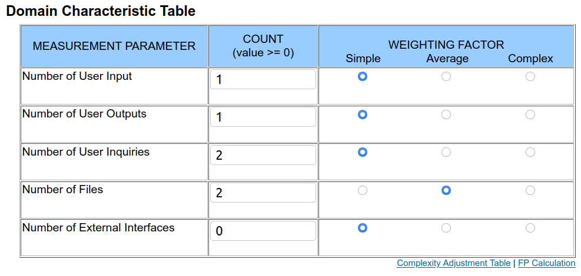

# Use Case Specification: Download file
{: .no_toc }

## Table of contents
{: .no_toc .text-delta }

1. TOC
{:toc}

## Show file structure
### Brief Description
The user requests to download a specific file (given the space and the correct index) via HTTPS. The index for the file must be extracted from the reference file which can be done only in the frontend by the user. If the user's session is valid, the server sends the requested file via the individual websocket endpoint to the user. The user can then open the file locally.

### Mockup

## Flow of Evenets
### Basic Flow

## Gherkin file
[The .feature file](https://github.com/Vaultionizer/vault-server/blob/develop/src/test/resources/features/downloadFile.feature)

### Alternative Flow
n/a

## Special Requirements
n/a

## Preconditions
* User is logged in
* User has valid reference file stored encrypted on the server
* The space is non-empty
* User has valid session key and websocket token
* User has subscribed to individual download endpoint

## Postconditions
* User can open the file.
* On the server's side, the read process is reverted.

## Extension Points
n/a

## Function Points

Function points: **35.31**
