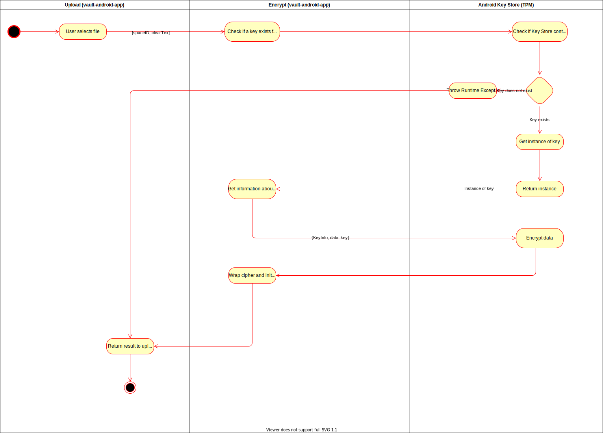
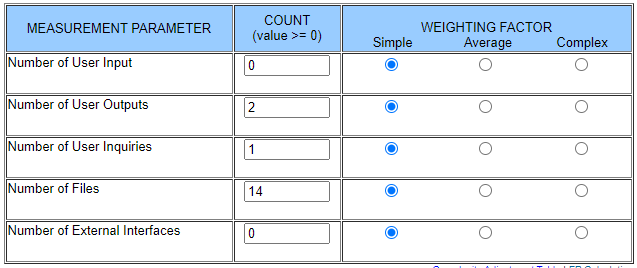

# Use Case Specification: Download file
{: .no_toc }

## Table of contents
{: .no_toc .text-delta }

1. TOC
{:toc}

## Show file structure
### Brief Description
While uploading a file the data is encrypted using locally store key inside the device's trusted platform module. 

### Mockup
tbd

## Flow of Evenets
### Basic Flow

## Gherkin file
n/a

### Alternative Flow
n/a

## Special Requirements
n/a

## Preconditions
* Key exists
* Key has right specs

## Postconditions
* Data gets uploaded

## Extension Points
n/a

## Function Points

Function points: **26.75**
