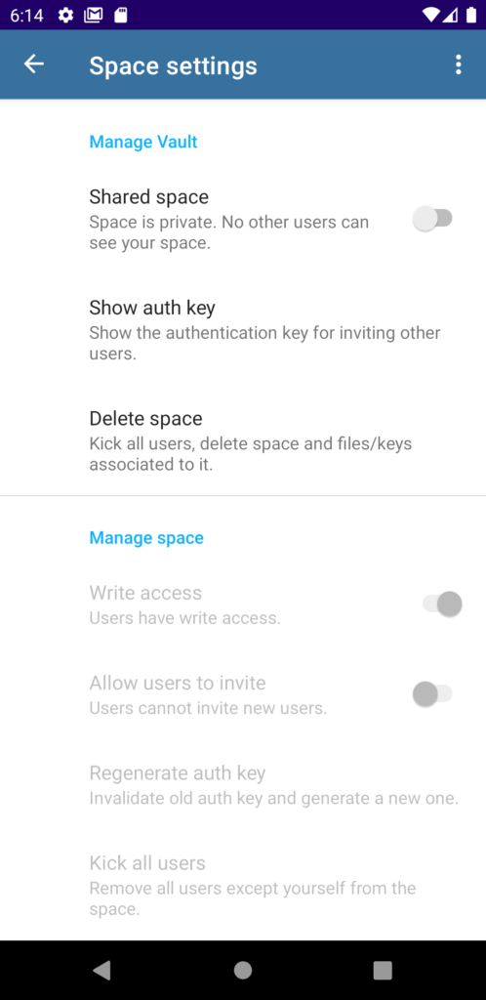
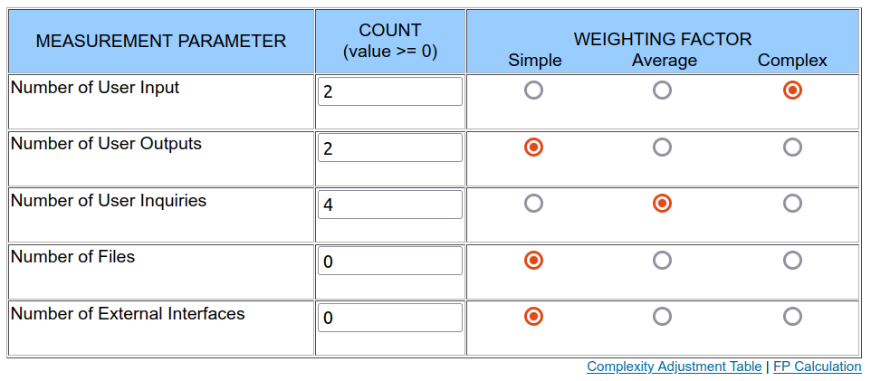

# Use Case Specification: Manage Permissions
{: .no_toc }

## Table of contents
{: .no_toc .text-delta }

1. TOC
{:toc}

## Manage Permissions
### Brief Description
The user should be able to do basic management of a shared space of which the user is the owner. Therefore a fragment to manage the space is needed in which these basic management options are available.

### Mockup

## Flow of Evenets
### Basic Flow
n/a

## Gherkin file
You can find the feature file for this use case [here](https://github.com/Vaultionizer/vault-server/blob/develop/src/test/resources/features/manageSpace.feature).

### Alternative Flow
n/a

## Special Requirements
n/a

## Preconditions
* User is logged in
* The user has a shared space

## Postconditions
* The space can be set private
* The user can kick users
* The user can show the auth key.
* The delete space button can be used
* A new auth key can be generated

## Extension Points
n/a

## Function Points

Function points: **38.52**
