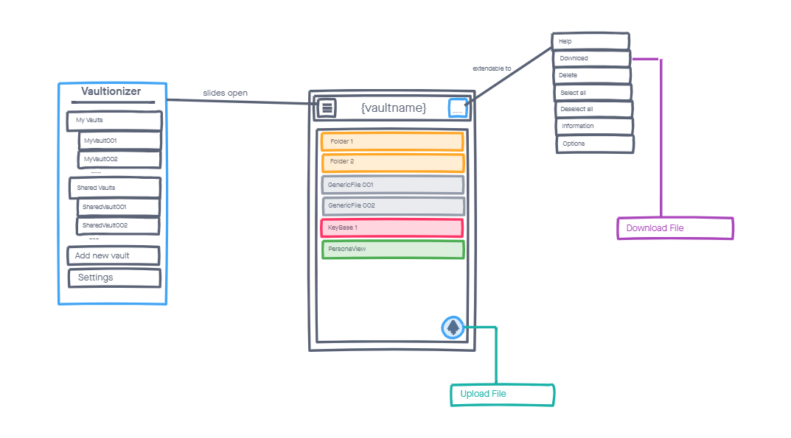
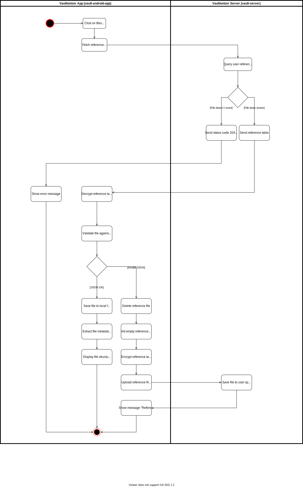

# Use Case Specification: Show file structure
{: .no_toc }

## Table of contents
{: .no_toc .text-delta }

1. TOC
{:toc}

## Show file structure
### Brief Description
The file structure is stored inside an encrypted reference table (JSON file) and stored on the server in order to be able to synchronize the files between multiple devices.
After the client downloaded the table and successfully decrypted the file, parsing of the file structure becomes possible.

### Mockup

## Flow of Evenets
### Basic Flow

## Gherkin file
You can find the feature file for this use case [here](https://github.com/Vaultionizer/vault-android-app/blob/master/app/src/test/java/com/vaultionizer/vaultapp/features/FileViewerUC.feature).

### Alternative Flow
n/a

## Special Requirements
n/a

## Preconditions
* User is logged in
* User has valid reference file stored encrypted on the server

## Postconditions
n/a

## Extension Points
n/a
