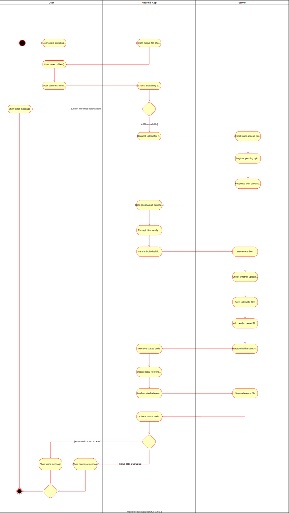

# Use Case Specification: Upload file
{: .no_toc }

## Table of contents
{: .no_toc .text-delta }

1. TOC
{:toc}

## Create Space
### Brief Description
In order to upload a file, the user has to request the server to reserve indices for uploading. The user can then send the actual files each with the according index to the server given the user's credentials are valid. The file is stored with filename as some index to reduce meta data. The user is notified that the file has been uploaded. 

### Mockup
tbd

## Flow of Evenets
### Basic Flow

## Gherkin file
[The .feature file](https://github.com/Vaultionizer/vault-server/blob/develop/src/test/resources/features/uploadFile.feature)

### Alternative Flow
n/a

## Special Requirements
n/a

## Preconditions
* User is logged in
* User has session key and websocket token
* User is connected to websocket at upload endpoint
* User has latest version of reference file

## Postconditions
* File has been uploaded
* Reference file has been edited and uploaded
* Save index (the index uploaded files are stored as) has increased

## Extension Points
n/a

Function points: **58,85**